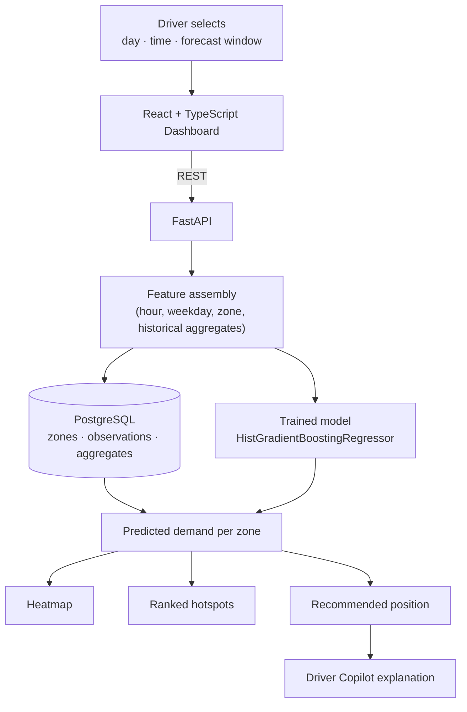

<h1 align="center">🚕 RideDemand</h1>
<h3 align="center">Ride-Hailing Demand Heatmap Predictor</h3>

<p align="center">
  
  
  
  
  
  
</p>

RideDemand is a full-stack machine-learning application that forecasts ride demand across
geographic zones for a selected day, time and forecast window. It visualises predicted demand
on an interactive map and recommends the area where a driver should position themselves next.

A driver between fares has one decision to make — *where do I go now?* That answer is buried in
historical trip data that no individual driver can read. RideDemand turns that history into a
forecast they can act on in a single click.

> **Scope note.** Predictions are learned from **historical** trip records. This is not a live
> traffic or live rider-demand feed, and the figures are forecasts, not guaranteed demand.

---

## ✨ Key Features

- **Time-based demand forecasting** — pick a day, an hour and a forecast window (30 min / 60 min / 2 hours)
- **Geographic demand heatmap** — predicted demand rendered per grid cell on a real Leaflet + OpenStreetMap map
- **Top demand areas** — hotspot zones ranked by predicted demand, computed on the backend
- **Recommended position** — the single highest-demand zone, with the figures that justify the choice
- **Demand trend** — predicted demand across all 24 hours of the selected day
- **Driver Copilot** — a plain-language explanation of the forecast (LLM-backed, with a deterministic fallback so it works with no API key)
- **Configurable geographic grid** — one grid definition shared by preprocessing, training, API and map
- **REST API** — FastAPI with auto-generated OpenAPI docs
- **PostgreSQL persistence** — zones, historical demand observations, aggregates and model metadata
- **Fully containerised** — Docker Compose brings up database, API and frontend

---

## 🏗️ How It Works



**Data flow**

1. **Ingest** — historical pickup records are downloaded and filtered to the study area.
2. **Aggregate** — every pickup is snapped to a `0.01°` grid cell and counted per cell, per hour.
3. **Persist** — zones and hourly demand observations are loaded into PostgreSQL.
4. **Train** — features are derived from the training dates only, then a gradient boosting model is fitted and scored on a held-out period.
5. **Serve** — FastAPI rebuilds the same features for the requested slot, predicts demand for every zone, then ranks them and selects a recommendation.
6. **Present** — React renders the heatmap, hotspot list, recommendation and explanation. The frontend performs no prediction, ranking or scoring of its own.

---

## 🛠️ Tech Stack

| Layer | Technology |
|---|---|
| Frontend | React 19, TypeScript, Vite |
| Maps | Leaflet, React-Leaflet, OpenStreetMap tiles |
| Backend | Python 3.12+, FastAPI, Pydantic |
| Database | PostgreSQL 16, SQLAlchemy 2 |
| Data / ML | pandas, NumPy, scikit-learn, joblib |
| Containerisation | Docker, Docker Compose, nginx |
| Copilot (optional) | Anthropic Claude, with a deterministic fallback |
| Testing | pytest, oxlint, TypeScript compiler |

---

## 🤖 Machine Learning

**Problem.** Predict the number of ride requests in a given grid cell, for a given weekday and hour.

**Preparation.** Pickups are snapped to a configurable `0.01°` latitude/longitude grid
(`floor(coord / grid_size) * grid_size`) and aggregated per cell per hour. Cells below a minimum
activity threshold are dropped as too sparse, leaving **166 zones** covering ~97% of all pickups.
The result is expanded into a dense panel of every `(zone, date, hour)` slot, with quiet hours
filled in as zero — roughly 42% of rows, and real signal the model has to learn.

**Features.** `hour`, `day_of_week`, `is_weekend`, `grid_lat`, `grid_lng`, plus historical
demand aggregates for the zone at several granularities. All aggregates are computed from the
**training dates only**, so no test-period information reaches the model.

**Model.** `HistGradientBoostingRegressor` (scikit-learn). Rather than predicting demand
directly, it predicts the **residual against the historical average** for that
`(zone, weekday, hour)` slot — a formulation chosen on a validation split because the plain
average is already a strong predictor for aggregated counts.

**Evaluation.** Split chronologically: the earliest 80% of dates train, the most recent 20% are
held out. A random split would leak future information into the past.

| Metric | Value |
|---|---|
| **MAE** | **1.7705** requests/hour per zone |
| Baseline MAE (historical average for the same slot) | 1.7838 requests/hour per zone |
| R² | 0.8978 |
| Training rows | 286,848 |
| Test rows | 75,696 |

**Reading these honestly.** MAE is measured in requests per hour per zone, on dates the model
never saw during training. The model beats the historical-average baseline by roughly **0.75%** —
a real improvement, but a small one. For hourly counts aggregated over ~1 km cells, the
per-slot historical average is already close to the best available predictor. The R² of 0.90
mostly reflects the large, easily-learned gap between a busy central cell in the evening and a
quiet outer cell at 4 AM; it is not evidence of a sophisticated model. Both figures are returned
side by side from `GET /api/model` so the model's actual contribution stays visible.

Every metric above is produced by `scripts/train_model.py` and re-running the pipeline
reproduces them exactly — the random seed is fixed. None is hand-written.

---

## 📍 Dataset & Location Assumption

The demonstration uses **historical New York City ride-hailing pickup records from 2014**,
released by the NYC Taxi & Limousine Commission under a Freedom of Information Law request and
published via [FiveThirtyEight's `uber-tlc-foil-response`](https://github.com/fivethirtyeight/uber-tlc-foil-response)
repository. Each row is one pickup: timestamp, latitude, longitude.

**Why NYC.** It is one of the few publicly available, legally usable trip datasets with raw
latitude/longitude at the row level, which is what makes a geographic grid possible. Later TLC
releases publish anonymised zone IDs instead, which cannot support this approach.

**Adaptability.** Nothing in the pipeline is NYC-specific by design. The city is defined by
configuration — bounding box, map centre and grid size are environment variables — so the same
workflow applies to any city with equivalent trip data (timestamp + coordinates). The bundled
neighbourhood labels and the default bounding box would need replacing for a new city.

> This is **historical** data, not a live rider-demand feed. The application forecasts patterns
> that existed in the source data; it does not observe current conditions.

Raw CSVs (~87 MB) are **not committed** — `scripts/prepare_data.py` downloads them on demand.

---

## 🚀 Getting Started

### Prerequisites

| Requirement | Version |
|---|---|
| Docker + Docker Compose | any recent version (Option A) |
| Python | 3.12+ (Option B) |
| Node.js | 20+ (Option B) |
| PostgreSQL | 14+ (Option B) |

The data preparation step downloads ~87 MB of source data, so an internet connection is
required the first time.

```bash
git clone https://github.com/POOJIKASRI-V-29/RideDemand-Driver-Demand-Forecast.git
cd RideDemand-Driver-Demand-Forecast
cp .env.example .env
```

### Option A — Docker (recommended)

```bash
docker compose up -d postgres
docker compose --profile setup run --rm pipeline   # download → load → train
docker compose up -d backend frontend
```

| Service | URL |
|---|---|
| Dashboard | http://localhost:3000 |
| API | http://localhost:8000 |
| API docs | http://localhost:8000/docs |

The pipeline is a separate one-shot service on purpose: it downloads data and trains a model,
which should not repeat on every container restart.

```bash
docker compose logs -f backend   # follow logs
docker compose down              # stop
docker compose down -v           # stop and drop the database volume
```

> Already running PostgreSQL on port 5432? Set `POSTGRES_PORT` to a free port (e.g. `5433`) in
> `.env` first — only the published port changes.

### Option B — Local development

**1. Database**

```bash
createdb ridedemand
psql -d postgres -c "CREATE ROLE ridedemand LOGIN PASSWORD 'ridedemand' CREATEDB"
psql -d postgres -c "ALTER DATABASE ridedemand OWNER TO ridedemand"
```

**2. Backend + pipeline**

```bash
cd backend
python3 -m venv .venv && source .venv/bin/activate
pip install -r requirements-dev.txt
cp .env.example .env

python -m scripts.prepare_data --months apr14 may14 jun14   # download + aggregate
python -m scripts.load_db                                   # load into PostgreSQL
python -m scripts.train_model                               # train + evaluate

uvicorn app.main:app --reload --port 8000
```

**3. Frontend** (second terminal)

```bash
cd frontend
npm install
npm run dev     # http://localhost:5173
```

Check `http://localhost:8000/health` — `"status": "ok"` with a non-zero `zones_loaded` means the
pipeline succeeded. If the model has not been trained yet, the API serves the historical-average
baseline and says so; the trained model is picked up automatically once it exists.

<details>
<summary><b>Useful pipeline options</b></summary>

```bash
python -m scripts.prepare_data --sample-fraction 0.1    # quick smoke run
python -m scripts.prepare_data --grid-size 0.02         # coarser cells
python -m scripts.prepare_data --months apr14 may14 jun14 jul14 aug14 sep14
```

Changing the grid size means re-running all three scripts, and `GRID_SIZE` must match in `.env`.

</details>

---

## 🔌 API Overview

Interactive documentation at `/docs`; the OpenAPI schema at `/openapi.json`.

| Endpoint | Purpose |
|---|---|
| `GET /health` | Service health: database, model and data status |
| `GET /api/config` | Grid size, map centre and selector options for the frontend |
| `GET /api/demand` | Predicted demand for every zone, plus the day's hourly profile |
| `GET /api/hotspots` | The top N zones, ranked by predicted demand |
| `GET /api/recommendation` | The single best zone, with supporting figures |
| `GET` / `POST /api/copilot` | Plain-language explanation of the current forecast |
| `GET /api/model` | Model provenance and its measured metrics |

Shared query parameters: `day` (name or `0`–`6`), `hour` (`0`–`23`), `window` (`30`, `60`, `120`).
Invalid parameters return `422` with a message naming the valid values.

---

## 🧪 Testing

```bash
cd backend && source .venv/bin/activate
python -m pytest        # 90 tests
```

The suite runs against its own database (`DATABASE_URL` with `_test` appended) so it never
touches development data, and skips cleanly if no PostgreSQL server is reachable. It covers the
demand, hotspot, recommendation, copilot, health and model endpoints, grid mathematics, forecast
window arithmetic, parameter validation, and the trained model artifact.

```bash
cd frontend
npm run lint     # oxlint
npm run build    # TypeScript check + production build
```

---

## ⚠️ Assumptions & Limitations

These are deliberate scope boundaries for this build:

- **Historical, not live.** Forecasts describe patterns in the source data, not current conditions. There is no live traffic, weather or rider-demand feed.
- **Demonstration dataset is NYC 2014.** The architecture is city-agnostic, but the bundled bounding box and neighbourhood labels are NYC-specific.
- **Pickups stand in for demand.** The data records completed pickups, not requests, so unmet demand is invisible.
- **Predictions are estimates.** A predicted figure is not guaranteed demand for any individual driver.
- **The model's edge over a naive baseline is small** (~0.75% MAE) and is reported as such rather than overstated.
- **Sub-hourly windows are interpolated.** Source data is hourly, so the 30-minute window is half the hourly rate.
- **No distance, travel time or ETA.** The dataset carries no driver location or trip geometry, so none is shown.
- **No confidence intervals.** A point-estimate regressor produces none; the number of historical observations behind each figure is exposed instead.
- **Earnings simulation and multi-driver load balancing are not implemented** — these were listed as stretch goals.
- **Desktop-first layout.** The dashboard reflows on narrow windows but has no dedicated mobile experience.

---

## 🔮 Future Improvements

Not implemented — reasonable next steps:

- Live demand integration and real-time traffic/weather features
- Driver earnings estimation
- Multi-driver load balancing across recommended zones
- Support for additional cities with equivalent trip data
- Sub-hourly aggregation, so short forecast windows are predicted rather than interpolated
- Calibrated uncertainty (e.g. quantile regression) to show a range instead of a point estimate
- Predicted-vs-actual monitoring to keep accuracy continuously verifiable

---

## 👩‍💻 Author

**Poojikasri V** — [@POOJIKASRI-V-29](https://github.com/POOJIKASRI-V-29)

